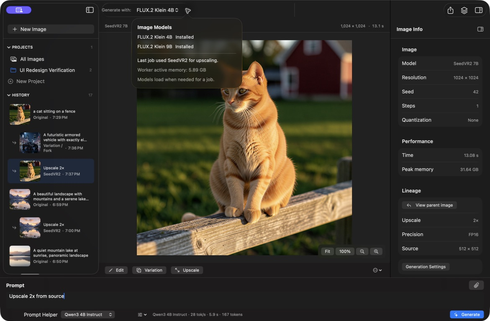

# Local Image Studio

[English](README.md) | [日本語](README.ja.md)

Local Image Studioは、Apple Silicon向けに開発したネイティブmacOS画像生成ワークスペースです。SwiftUIフロントエンドから、[MFLUX](https://github.com/filipstrand/mflux)とAppleの[MLX](https://github.com/ml-explore/mlx)を使用するローカルPython推論サービスを操作します。画像生成、プロンプト改善、メタデータ、画像保存はMac上で完結し、クラウド画像生成サービスを必要としません。



> **開発者プレビュー:** 現在はarm64専用、アドホック署名、未公証です。ローカルPython環境とモデルキャッシュを設定できる開発者を対象としています。

## 主な機能

- MFLUX/MLXを使用したFLUX.2 Klein 4B、FLUX.2 Klein 9B、Krea 2 Turboのローカル画像生成
- 画像生成、FLUX参照画像編集、バリエーション、再生成、書き出し、LoRAの再利用
- SeedVR2 7B FP16による2倍・4倍アップスケール
- 履歴、生成系統、メタデータ、アーカイブ、復元を備えたプロジェクト形式の画像ライブラリ
- LM StudioまたはoMLXで配信するローカルモデルを使った任意のプロンプト改善
- 英語・日本語のインターフェース

## アーキテクチャ

```text
SwiftUIアプリケーション
       │ 127.0.0.1上の認証付きHTTP
       ▼
ローカルPythonサービス（backend_v2.py）
       │ 非公開のstdin/stdoutプロトコル
       ▼
常駐MFLUXワーカー → MLX → Apple Silicon GPU
```

バックエンドはループバックインターフェースだけで待ち受け、起動ごとに生成するランダムトークンを要求します。生成ワーカーではHugging FaceとTransformersのオフラインモードを有効にします。LM Studio（`127.0.0.1:1234`）とoMLX（`127.0.0.1:8000`）へ接続するのは、任意のローカルプロンプト改善機能を使用した場合だけです。

## 動作要件

- macOS 13以降を搭載したApple Silicon Mac
- 相互に互換性のあるSwiftコンパイラとmacOS SDKを含むApple Command Line ToolsまたはXcode
- Python 3.10以降
- MFLUX 0.19.1およびMLX 0.32.2（既定の実行ファイルは`~/.local/share/uv/tools/mflux/bin/python`）
- 使用する各生成モデルのローカルキャッシュ

MFLUXのPython実行ファイルが別の場所にある場合は、起動前に`LIS_MFLUX_PYTHON`を設定してください。互換性のあるSwiftコンパイラが`/usr/bin/swiftc`ではない場合は、`LIS_SWIFTC`を設定してください。

モデルの重みは同梱していません。FLUXおよびKreaの重みを生成時に自動ダウンロードすることもありません。唯一の例外として、SeedVR2はモデル画面に明示的な**SeedVR2 7Bをインストール（約14 GB）**操作を用意し、ユーザーが選択した場合に限りチェックポイントをダウンロードします。

## クリーンクローンからのビルド

```sh
git clone https://github.com/Xombie2000/local-Image-studio.git
cd local-Image-studio
./build_v2_app.sh --build-only
```

ビルドのみのコマンドは`~/Applications`を変更せず、`build/Local Image Studio.app`を作成します。ローカルにビルドしてインストールする場合は次を実行します。

```sh
./build_v2_app.sh
```

インストールコマンドは、既存アプリを初めて置き換える際に`~/Applications/Local Image Studio v1.app`として保存し、`~/Applications/Local Image Studio.app`をインストールします。このプレビューはDeveloper ID署名およびAppleの公証を受けていないため、初回起動時に「システム設定」で許可が必要になる場合があります。

## テスト

```sh
python3 -m venv .venv
.venv/bin/python -m pip install -r requirements-dev.txt
.venv/bin/python -m unittest discover -s tests -p 'test_*.py'
./tests/run_swift_state_tests.sh
```

通常のユニットテストは一時ストレージと偽のワーカーを使用するため、モデルデータを読み込んだりダウンロードしたりしません。`tests/`内の推論・テレメトリスクリプトは任意の統合チェックであり、設定済みのMFLUX環境とローカルモデルキャッシュが必要です。

## データとプライバシー

- 生成画像: `~/Pictures/Local Image Studio/`
- メタデータ: `~/Library/Application Support/Local Image Studio/history.sqlite3`
- LoRA: `~/Library/Application Support/Local Image Studio/LoRAs/`
- モデルの重み: 共有ローカルHugging Faceキャッシュ

使用中のプロジェクトは`.lisproject`パッケージです。アーカイブ時は可逆圧縮WebPをZIPコンテナに保存し、復元時は記録済みのパスにPNGを再作成します。このリポジトリにモデルの重み、生成画像ライブラリ、ユーザーデータベースは含まれていません。

## リポジトリ構成

- `macos/` — SwiftUIアプリケーション、モデル、ストア、ローカライズ、プロパティリスト
- `backend_v2.py` — ローカルAPI、SQLite履歴、プロジェクト、ジョブ、プロンプト改善のルーティング
- `mflux_worker.py` — 常駐MFLUX生成・SeedVR2ワーカー
- `build_v2_app.sh` — コマンドラインでのビルド、バンドル、アイコン生成、署名、任意インストール
- `tests/` — Python回帰テスト、Swift状態テスト、任意のローカル推論チェック
- `docs/` — 実装メモ、互換性パッチ、検証記録

## モデルと依存関係のライセンス

このリポジトリのソースコードはMITライセンスですが、第三者モデルの重みに対する権利を付与するものではありません。特にFLUX.2 Klein 9BにはFLUX Non-Commercial License、Krea 2 TurboにはKrea 2 Community Licenseが適用されます。ダウンロードや利用の前に、特に商用・本番利用の場合は該当する条件を確認してください。上流リンクとライセンス概要は[THIRD_PARTY_NOTICES.md](THIRD_PARTY_NOTICES.md)にあります。

## リリース状態

現在は`v2.0.0-preview.1`のような開発者プレビューを想定しています。一般ユーザー向けリリースには、Developer ID署名、Appleの公証、配布・更新手順の文書化も必要です。

## ライセンス

Local Image Studioのソースコードは[MIT License](LICENSE)で提供します。MFLUX由来の互換性ファイルには、[THIRD_PARTY_NOTICES.md](THIRD_PARTY_NOTICES.md)に記載した上流のMITライセンス表示が引き続き適用されます。
